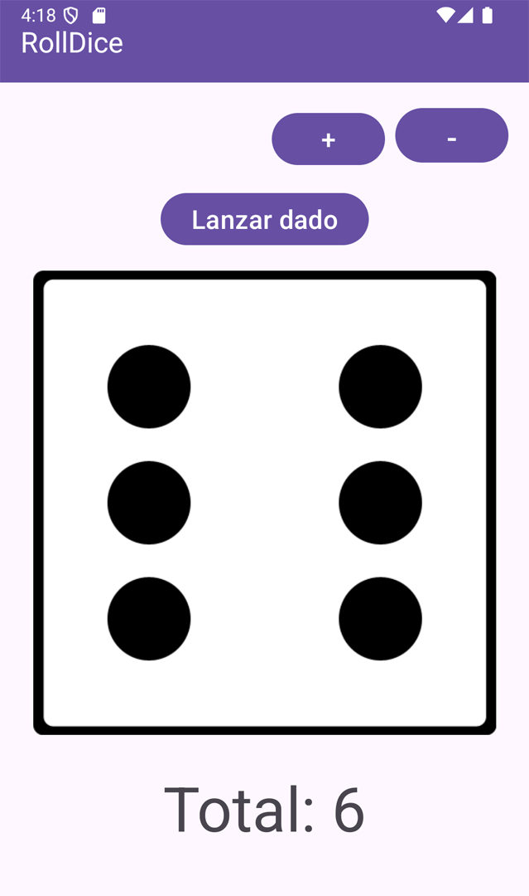
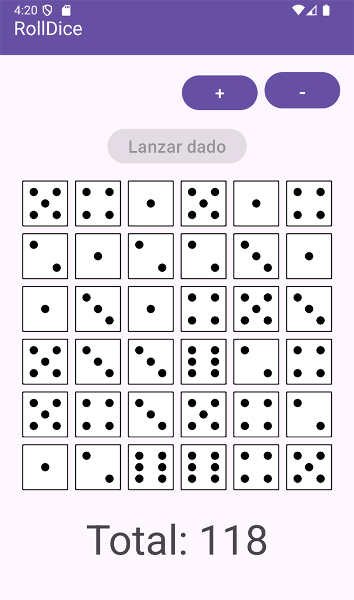

# RollDice 🎲

Una sencilla aplicación de Android desarrollada con Kotlin que permite a los usuarios lanzar dados y generar resultados aleatorios. Ideal para juegos de mesa, decisiones rápidas o simplemente para divertirse.

## Características 🚀

- **Lanzamiento de uno o varios dados**: Lanza entre 1 y 36 dados a la vez.
- **Animaciones suaves**: Disfruta de una experiencia visual atractiva al lanzar los dados.
- **Interfaz intuitiva**: Diseño minimalista y fácil de usar.

## Tecnologías utilizadas 🛠️

- **Lenguaje:** Kotlin
- **IDE:** Android Studio
- **Diseño:** Material Design Components
- **Compatibilidad:** Android 7.0 (Nougat) y superior

## Capturas de pantalla 📸

| Inicio                          | Máximo de dados                |
|---------------------------------|--------------------------------|
| |  |

## Instalación 🚧

1. Clona este repositorio:
   ```bash
   git clone https://github.com/mroblesdev/rolldice-kotlin.git

2. Abre el proyecto en Android Studio.
3. Conecta un dispositivo físico o configura un emulador.
4. Haz clic en Run para instalar la aplicación.

## Autor ✒️
- **Marco Robles** - *Desarrollo* - [mroblesdev](https://github.com/mroblesdev)

## Contribuciones

Siéntete libre de contribuir al proyecto.

## Expresiones de Gratitud 🎁

- Comenta a otros sobre este proyecto 📢
- Invitame una cerveza 🍺 o un café ☕ [Da clic aquí](https://www.paypal.com/paypalme/markorobles?locale.x=es_XC.).

## Licencia

Este proyecto está bajo la Licencia [MIT](LICENSE).

